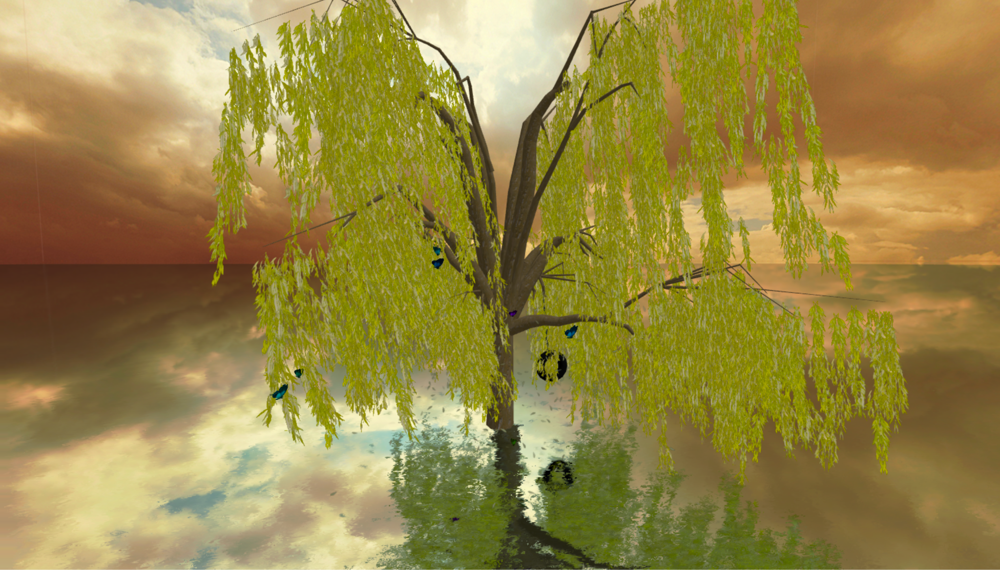

# Procedural Willow Tree Animation
* CS 174C Final Project
* Created by: Ben Falkenburg, Enoch Lee, Matthew Sun
* Instructors: Dr. Demetri Terzopoulos, Zhi (Mike) Li



## Getting Started

clone with
```
git clone https://github.com/sun3matthew/ProceduralWillowTree.git
```

install dependencies with
```
npm install
```

start the server with
```
npx vite
```

# Overview
This project aims to create a detailed and artistic animation of a willow tree swaying in the wind, surrounded by other objects governed by physics such as swinging vines, floating butterflies and falling leaves.
The tree is suspended in a reflective body of water, which we have custom shaders written in `/src/glsl/`.

## Willow Tree - Spline Interpolation
* `/src/js/WillowTree.js`
* `/src/js/Vine.js`


The branches of the willow tree are generated using spline interpolation, and constructed using a recursive generation algorithm.
We use Catmull-Rom splines to define the curvature and directions of the branches.
Branches are generated at random upon program initiation, where each branch is represented by a vector of points originating at the trunk and spreading outward.
The width of the branches tapers as a function of distance from the trunk, terminating as a point.
Branches occasionally bifurcate, in which case the secondary branch are modeled as another spline rooted at the divergence point.

To simulate natural growth patterns, the branches' widths taper as a function of distance, and they slope downwards as function of height. In addition, at the ends of each of the branches are vines.


## Falling Leaves - Particle Physics System
* `/src/js/LeafParticles.js`


Leaves falling from the tree are simulated using a particle system.
* Leaf drift (in x and z positions): determined by its RNG `hash`, gravity, wind, and air resistance
* Procedural wind effects: Uses Perlin-style Simplex Noise to generate natural wind patterns affecting leaf motion
* Gradual fade: Implements fade-in when leaves spawn and fade-out after landing
* Prewarm: Makes sure the particle system stabilizes before the demo starts.
* Simple collision detection: Leaves drift for a bit after they touch the ground, then fade out

## Butterflies - Parametric Motion Curves
* `/src/js/ButterflyScene.js`
* `/src/js/HermiteSpline.js`


Butterflies are animated using the `ButterflyScene` particle system, with parametric equations to define a natural, fluid flight path.
The wings oscillate using a simple sine function:
$$\theta(t) = A\sin(\omega t)$$
where $A$ controls amplitude and $\theta$ determines the speed of the wing flaps.
The `butterfly` attribute uses keyframe animation using `THREE.AnimationMixer()`, along with forwards kinematics to traverse spline attribute by updating `flightProgress`.
The butterflies traverse its `spline` attribute, which is a randomly generated `HermiteSpline` object.
Colors are also randomly generated by modifying the diffuse color.

## Vines & Tire Swing - Mass-Spring System Physics
* `/src/js/Vine.js`
* `/src/js/MassSpringSys.js`
* `/src/js/Swing.js`


The vines hanging from the tree, along with a tire swing, are simulated using mass-spring dynamics to achieve chain-like physics.
We model this via Hooke’s Law for Spring Forces: 
$$F = -k(x - x_0) - bv$$
where $k$ is the spring constant (stiffness of the vine/swing), $x-x_0$ is the displacement from equilibrium, $b$ is the damping coefficient (to prevent excessive oscillation), and $v$ is the velocity.
Each vine is modeled as a series of connected mass points, creating a rope-like behavior.

For the tire, we physically model it using `THREE.TorusGeometry()`